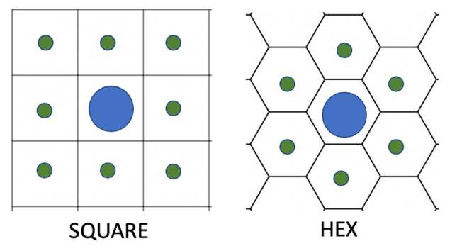

# Escape Introduction

CS4233 presents techniques for designing and
implementing systems using primarily an object-oriented approach. This
requires the use of the following skills and techniques:

-   developing an object model from requirements

-   identifying relationships between objects

-   assigning behavior to classes that supports loose coupling and high
    cohesion

-   applying established design principles and patterns

-   thorough testing

-   evolutionary design

Finding a non-trivial project that can be completed in a seven week
course is challenging. Experience indicates that games, especially board
games, offer a reasonable blend of interest, complexity, and variety for
students to exhibit competence in the above skills and techniques.

This term we will work on a game called Escape. Escape has the following features:

-   variable board dimensions

-   variable board location shapes (e.g. squares and hexes)

-   rule variations such as game length, victory conditions, and so on

-   different types of pieces with various attributes

An ideal scenario for this course is one where a completely playable
game with user interface and human-player interaction results from the
project. At this time, the necessary infrastructure does not exist.
Therefore, students are responsible for developing a game manager that
initializes a game variation, maintains the game state, accepts moves in
the appropriate order from an external player or controller, validates
the move, reports on the results of moves, and determines victory
situations. The following image shows the two components and how they
interact.


---

Note: ! You are given a detailed specification of the `Escape` game; however, as we experience in real-world software development,  ambiguity and incomplete specifications are a fact of life in most situations, especially in the rapid or continual release cycles that we encounter today. Just as you design and develop software iteratively, refining
your design and implementation in each iteration, requirements also evolve. Even small software projects evolve and requirements change due to changes in business environment or incomplete or ambiguous requirements. 
This means that you, as the software developer, have a responsibility to ask questions when you are not sure of the meaning of a statement. If you find errors you need to make me and the rest of the class aware of these (Discord is the best way). 

---

# Escape: Game Mechanics

Escape is a game that offers rich variability to which students may apply several design patterns and principles in implementing the game software. As the name suggests, the goal of Escape is for players to have their pieces "escape" from the board while preventing opponents' pieces from escaping. Depending upon the game variation, there are different means
of escaping, determining the value of escaped pieces, and so on. This
section describes the basic game mechanics. Each game begins with a set of pieces, some set of properties assigned to each piece type, a board consisting of some type of tiles or shape, and rules that guide the game play. It also includes the initial board configuration, and victory conditions.

## Gameplay

The gameplay for Escape is simple. Two or more players take turns moving
one or more of their pieces each turn until one player achieves victory
conditions or the game results in a draw.

* Before the game begins players place all of their pieces on the game board. How the pieces are placed and the board configuration occur
outside of the game manager software that you will develop. 

* A game configuration file specifies the initial setup to your game manager (see the section  [Configuring Games](#escape-configuring-games)). 

* Once the game configuration is established the play begins. There is an order in which the players make their moves that is established in the game configuration file. 

* A turn is when all players move their piece(s) for the turn. The basic move in a turn follows the following sequence when the `move()` method of the game manager is invoked:

    1.  Moving player makes a move by indicating the starting (source) coordinate for the piece and the destination (target) coordinate. If the player cannot make any moves---for example if the   player has no more pieces on the board that make a valid move---then the opponent wins and the game is over and the game manager returns `false`. If the game is already over then the game manager returns `false`.

    2.  The game manager verifies that the move is legal. Legal depends upon some of the game rules in effect (See the [Game Rules](#escape-game-rules) page). If the move is illegal, the game
        manager returns a `false` response and the player starts over again
        with the previous step (nothing changes in the game state). However, the following *always* represents an illegal move and the game manager will return `false`:

        -   There is no piece on the source location.

        -   There is a piece on the source location, but it does not belong
            to the moving player.

        -   The source and target coordinates represent the same location on
            the board (i.e. the piece is not moving).

    3.  The game manager makes the move. If the target location has the
        `EXIT` attribute then the piece is removed from the board.

    4.  The game manager makes other adjustments to the game state,
        depending upon the rules in effect (e.g. the target location was
        occupied by an opposing piece or some type of engagement
        occurred).

    5.  The game manager adjusts the score if necessary.

    6.  The game manager determines if either side won or if a draw
        occurred; in which case the game is over.

    7.  The game manager returns `true`.

---

NOTE:  *Each player will move only one piece per turn and there will only be two players identified as `PLAYER1` and `PLAYER2`.You do not have to worry about the coordinates passed in being `null` or off the board. That is the responsibility of the game controller, which is outside of your project.*

---

# Escape: Game Boards

Escape is played on a board that consists of locations
(also called tiles).  Boards are 2-dimensional and the tiles can have different shapes: square and hexagon. Each tile is referenced by a coordinate that identifies a particular location.Coordinates are discussed in detail in the [Coordinates](#escape-coordinates) section. 

The following figures show the most common 2D boards:

<center><b>Square Board</b></center>  | <center><b>Hexagonal Board</b></center>
:------------------------------------:|:---------------------------------------:
          | 

---
*NOTE:  Since we are only dealing with 2D boards, the documentation from here on assumes that there are just two values describing the coordinate (x, y).*

---

The locations also have an attribute that indicates their type. There
are three types of locations:

-   `CLEAR`: This is the default for any location. It indicates that
    this is a plain location with no special characteristics.

-   `EXIT`: This is an exit location. Score is accumulated by moving
    pieces onto an EXIT location where they exit the board. The
    player's score is adjusted by the rules specified in the game
    configuration. A piece *may not move over an EXIT location*. Any attempt to cross an EXIT by a piece simply falls through the EXIT and is removed from the game.

    <!-- A piece *may not move over an `EXIT` location* unless
    they are able to fly over it. Any attempt to cross an `EXIT` by a piece without `FLY` capability simply falls throuth the `EXIT` and is removed from the game. -->

-   `BLOCK`: This type of location does not allow a piece to land on it.
    A piece may not cross over a BLOCK unless they have `UNBLOCK` capabilities.

    <!-- A piece may not cross over a BLOCK unless they have either `FLY` or
    `UNBLOCK` capabilities. -->

Locations are identified by their
coordinates, which are expressed as a pair of integers. The two integers
are called x and y but do not necessarily correspond to the x-y
coordinate scheme for the standard Cartesian grid. x refers to the row, and y refers to the column. The square board shown above has squares that are represented by 
coordinates of the form (row, column);  the opposite of the standard representation.

Boards may be finite or infinite. If the board is finite, the maximum number of rows and colums will be specified in the initial setup to your game manager ; `xMax` defines the max number of columns and `yMax` defines number of row. If either or both of `xMax` and y`Max` is `0`, then the board is considered infinite (see the section  [Configuring Games](#escape-configuring-games)).   

* In the above image, the SQUARE board on the left is a finite board and the HEX board on the right is an infinite board. 

* Finite boards always have the coordinate (1, 1) located in lower left
location from a canonical viewpoint of the player that moves first. If
there are two players seated at opposite sides of the board, one player
would have square (1, 1) at their lower left and the other would have
(1, 1) at their upper right location on the board. **Finite boards
always have coordinate components that are positive integers**.

* Infinite boards may have coordinate components that are any integral
value. There is a reference location at (0, 0) and all other locations
are relative to that (see the hexagonal board above). Notice the way the locations are related to each other in the boards. This is critical in order to determine the
distance and direction from one location to another and finding paths between them.

---

# Escape: Coordinates

A coordinate is more than just a pair of integers. Coordinates are
types that have properties and behavior. How much
behavior a coordinate has is one of the many design decisions that you
will make as you design and implement your project. The game manager
client only sees the Coordinate as an opaque object. You may extend
`Coordinate` and/or implement one or more classes that implement the
interface. The `Coordinate` interface has no required methods; it is a
[*marker interface*](https://www.baeldung.com/java-marker-interfaces).

One of the decisions that you will need to make early on is how many
classes you need, or want, in order to define coordinates and boards.

There are two types of coordinates in the basic board types described above.

1.  **SQUARE**: A coordinate that is used on square boards. The
    coordinate represents squares that may allow movement in any one of
    eight directions, horizontally, vertically, and diagonally.

2.  **HEX**: A coordinate that has six neighboring coordinates to which
    a piece may move. Boards with this type of coordinate do
    not recognize the concepts of orthogonality or diagonality.

<!-- 3.  **TRIANGLE**: A coordinate that is used for triangle boards. 
    A TRIANGLE coordinate has exactly three neighboring tiles. Boards with
    these tiles do not recognize the concepts of orthogonality and
    diagonality. **NOTE**: *The canonical labeling of triangle
    coordinates is that triangles with equal `x` and `y` values always
    point down as the triangles labeled (1, 1), (2, 2), etc. in the 
    [Triangle Board figure](GameBoards.md#TriangleBoard). -->

The starting code base contains an enumeration, `CoordinateID` that has
constants for each of the coordinate types you might encounter.

When pieces move in any game they move along paths that consist of a
sequence of individual moves from one tile to one of its neighbors. Each
coordinate type has a specific set of neighbors. The figure below
illustrates the neighbor sets for each basic coordinate type. The large blue
circle represents the piece and the smaller green circles represent the
neighbors.

[Neighbors](#Neighbors)


You will also find out that you need to compute other properties, for example the distance between two coordinates. As you develop your solution, you will incrementally add what you need, based upon your design.

---

# Escape: Game Pieces

The Escape pieces have a type. The type has a name, movement
pattern, and attributes that determine the piece's capabilities.

Escape uses named pieces that move, escape, and
possibly perform other actions such as engaging opponents. The names are
simply labels used to distinguish one type of piece from another. The
pieces are named after animals, but any label such as `Piece1, Piece2`,
and so on would work just as well. In one game configuration, the `HORSE` might be able to
move with DIAGONAL movement pattern (for example [`test1.egc`](./egc/test1.egc)), and in a different
variation, it might move with LINEAR pattern.

Pieces also have an arbitrary number of attributes that contribute to
the game play. For example, in one version pieces might have a numeric
value that is used in calculating how much that piece adds to the score
when it escapes from the board. Other attributes might include movement
limitations, special abilities, and so on. The attributes work in
conjunction with game variation rules to determine the game play.

The following sections describe the different movement patterns and
attributes. For simplicity, each of these is defined by enumeration constants in the
`EscapePiece` interface in the starting code base.

## Movement patterns 
[](#sec:movementPatterns)

Movement patterns describe how a piece type may move during the game
play. For example, in the game of checkers, the pieces may only move
diagonally; in chess the Rook moves orthogonally, and so on. The pattern
is just that &mdash; a pattern of movement. There is nothing in the pattern
that indicates any minimum or maximum number of spaces, or any other
attributes of the piece. **Every piece type must have exactly one
movement pattern associated with it**. Each movement pattern has an
enumeration constant in the `MovementPattern` enumeration in the
`EscapePiece` interface in the starting code base.

During a game, pieces move according to the movement pattern specified
by the movement pattern associated with their piece type, and any other
constraints or advantages that might be specified for that type. In
general, a piece moves along a path that is a sequence of individual
moves. Each individual move involves a move from a location to one of
it's neighbors. The movement pattern identifies which
subset of the neighbors a piece may move to.

The movement patterns and their meanings for Escape are:

-   `ORTHOGONAL`: Movement is only allowed along the horizontal or
    vertical axis. This pattern is only allowed for boards with `SQUARE`.

-   `DIAGONAL`: Movement is only allowed along the diagonal. This pattern is only allowed with `SQUARE` coordinate types. 

The below image illustrates the  `ORTHOGONAL` and `DIAGONAL` movement patterns.


-   `LINEAR`: Movement must be in a straight line. 
    *   For `SQUARE` boards,
    this means either orthogonally or diagonally. (see above image)
    * For `HEX` boards, it
    means in a line along one of the six directions of the sides. (see below image) 


<!-- -   `OMNI`: Piece may move to any location (not its own location though)
    using any path that is not restricted by other movement rules or
    attributes. The path must consist of individual moves from one tile
    to neighbors of that tile as defined by the coordinate type.  -->

The following table summarizes the valid combinations of
coordinate types for game versions and the movement patterns that are
allowed for those coordinate types. 

<!-- |            | ORTHOGONAL | DIAGONAL | LINEAR | OMNI | 
|------------	|:------------:	|:----------:	|:--------:	|:------:	|
| SQUARE   |      YES     |     YES    |    YES   |   YES  | 
| HEX      |      NO      |     NO     |    YES   |   YES  | -->

|            | ORTHOGONAL | DIAGONAL | LINEAR | 
|------------	|:------------:	|:----------:	|:--------:	|
| SQUARE   |      YES     |     YES    |    YES   | 
| HEX      |      NO      |     NO     |    YES   |  

<b>Allowable movement patterns for coordinate types</b>

---
*NOTE:  Every piece type **must** have a movement pattern. There are no defaults.*

---

## Piece attributes

Each Escape piece type has a set of attributes associated with it during a
game. All units with the same type have exactly the same attributes when
a game starts. There are two types of attributes, *simple attributes*
and *valued attributes*. Simple attributes are described only by name.
Valued attributes have an associated integer value. The attributes vary
by piece type and game variation. Attributes *must be explicitly
specified* in the game configuration file for any game.

The currently defined attributes are shown in this table along with their type and a brief description.

| Attribute 	|  Type  	| Brief description                               	|
|-----------	|:------:	|-------------------------------------------------	|
| VALUE     	| valued 	| The points associated with the piece            	|
| DISTANCE  	| valued 	| The maximum distance that this piece may move.   	|
| FLY       	| simple 	| This piece can cross over `BLOCK`, `EXIT`, and other pieces.    	| 
| JUMP      	| simple 	| This piece may jump over obstacles              	|
| UNBLOCK   	| simple 	| This piece may cross over a BLOCK location      	|

**Note:** Unless the piece has FLY attribute, it can't  cross over `BLOCK`, `EXIT` and other pieces.  

The rest of the subsections describe the attributes in more detail.

### The VALUE attribute
[](#ValueAttribute)

This is a valued attribute. It is a positive number that indicates the points a piece is worth when the game begins. This is used in calculating the score when pieces escape from the board. This value may change, depending upon the rule set selected for a game. For example, a piece might gain value points if it defeats an opponent's piece, or lose value points if it loses an encounter with an opponent.

**NOTE:** If this attribute is not present, then the default value for a starting piece is 1.

### The DISTANCE attribute

The valued attribute defines the maximum **`path`** distance that a piece with this piece type may travel during a turn. This distance is the maximum distance of a **legal path** from the piece’s starting point to ending point of a move. A legal path is the number of individual moves that a piece makes from the starting to ending location. The following diagram illustrates the path distances for different boards and movement patterns.  Each board/movement pattern combination might influence what a legal path might be.

<!-- The following diagram illustrates the difference between a path and the distance between two coordinates in a `SQUARE` board and a piece that has `OMNI` movement pattern. Each board/movement pattern combination might influence what a legal path might be. -->


 <center><b>Square Board Distances</b></center>  | <center><b>Hexagonal Board Distances</b></center> 
 |:------------------------------------:|:---------------------------------------:|
           |  

### The FLY attribute

Like the `DISTANCE` attribute, `FLY` is a value attribute. Any unit that has a `FLY` attribute can simply move from its starting location to the end point, as long as no other restrictions prevent it from doing so, without worrying about `BLOCK` or `EXIT` locations or pieces in the way. A piece with this attribute may move from the starting location to the ending location, as long as there is a *valid path that satisfies the movement pattern for the piece* that is **less than or equal to the integer value of this attribute.** For example, if the piece has a `ORTHOGONAL` movement pattern, the legal path must be movement that is either horizontal or vertical.

### The JUMP attribute

This is a simple attribute. A piece with this attribute can jump over other pieces that may be on the path from the piece's starting point to ending point of a move. A piece with `JUMP` may jump over just one piece at a time. If, for instance the desired path has two other pieces in consecutive locations along the path, then the `JUMP` would be invalid. If, however, two or more pieces are in the path and there is at least one empty location between pieces, then the `JUMP` is valid. The piece may not change directions during the jump. The figure below shows examples of valid and invalid jumps. The blue circle is the moving piece and the red circles represent other pieces (regardless of which player owns them). A piece with `JUMP` **may not** jump over a `BLOCK` or `EXIT` location; however it may jump over a piece and land on an `EXIT` location. Jumping over a piece takes two locations along the path. So, if a piece only has one location left when it attempts to jump, it cannot perform that jump.

<center><b><h2>Valid Moves</h2></b></center>  | <center><b><h2>Invalid Moves</h2></b></center>
:------------------------------------:|:---------------------------------------:
          | 
          | 


### The UNBLOCK attribute

A piece with this attribute may move accross locations that have the BLOCK attribute. The piece may **not** end the move on the BLOCK location, but otherwise, the BLOCK location is just like a CLEAR location for the piece with this attribute.

---

# Escape: Game Rules

Escape game has a set of rules that affect the game play.
These rules describe game characteristics such as the number of turns,
how to determine the score, victory conditions, rules of engagement, and
so on. This section describes the game rules and how they apply to
games.

Each rule has a label and an optional integer value. The rule labels are in the `Rule` interface in the starting code. The next subsections describe these rules in detail.

### TURN_LIMIT

This rule indicates that the game ends after some finite number of turns (one turn consists of each player making a move) have been made. When the number of turns indicated by the turn limit have been made, the game ends. The winner is the player that has removed the most points from the board through exit locations. Other rules may influence game play in conjunction with this rule, but a game with this rule will never last longer than the number of turns specified by this rule.

### SCORE

If this rule is present, then the winner is the player that first removes the number of points from the board. The starting number of points for any piece are determined by the [`VALUE` piece attribute](GamePieces.md#ValueAttribute). 

<!-- ### REMOVE

This rule indicates that if a player moves a piece to a location containing an opposing piece, the opposing piece is removed from the board and the moving piece is placed on that location. The points of the removed piece are not counted when determining a winner. -->

### POINT_CONFLICT

This indicates that when a player moves a piece onto a location containing an opposing player's piece, the piece with the lower current point value is removed and the other piece remains on the square. The remaining piece has its value reduced by the value of the removed piece. For example, if a `FROG` worth 5 points lands on a location with a `SNAIL` worth 2 points, then the `SNAIL` is removed and the `FROG` remains on the location with a value of 3 points. The two points for the removed `SNAIL` are not counted when determining the winner. If both pieces have the same value, then both are removed from the board and neither is counted in determining the winner.

<!-- If there are multiple pieces on a location that is attacked the reduction in points occurs by first reducing the points on the piece with the lowest current `VALUE`. If the piece is removed, and there are more points to reduce then the next lowest piece is reduced. If that piece is removed, then the next lowest valued piece is reduced, and so on. -->
<!-- 
**Example:** Assume a `HORSE` with a value of 10 encounters a stack of a `SNAIL` worth 1 point and two `FROG`s worth 5 points each, then the `HORSE` is removed and the `SNAIL` and one `FROG` is removed (total of 6 points) and the second `FROG` has 4 points removed from its value, leaving it with a `VALUE` of 1 point.

If there are two pieces with the same lowest value when reduction needs to be made, the pieces are chosen by sorting them by piece type alphabetically and taking the first one (e.g. `SNAIL` and `HORSE` would reduce the `HORSE`). -->

---

 Several constraints on the game rules and situations that may
arise during a game that are not explicitly described in the game rules.
This list attempts to describe those and explain the way to handle these situations. Some of these describe actions that the game manager implementation must adhere to.

<!-- 1.  `REMOVE` and `POINT_CONFLICT` are mutually exclusive. A game cannot
    have both rules. *If neither are used, then any move may not
    terminate on a location containing any other piece*. -->

1.  If `TURN_LIMIT` and `SCORE` are present, then the game ends when
    *either* one team achieves the score condition of removing points
    equal to or greater than the number specified in the `SCORE` rule,
    or the turn limit has been reached.

2.  In all game versions, your game should keep track of which player
    is, and should be making the move. `PLAYER1` *always* makes the
    first move of the game. After the first move is made, players
    alternate.

3.  If a player cannot make a move in the current game state and has not
    met the victory conditions, then the opposing player wins. The
    opposing player wins, even if that player also could not make a valid
    move in the current game state.

4.  All other things being equal, if both players have removed the same
    number of points and an end-of-game condition has been met, then the
    game is considered a draw.

5.  If an invalid move is attempted, the game manager will return
    `false` from the `move()` method and notify any observers. Do not
    change the game state.This allows the player who made the invalid
    move to then make a correct move with the next call to `move()`.

6.  When a player wins the game, return `true` from `move()` and notify
    the observers with the message "*PLAYERn* wins". Any attempted move
    after this should return `false` and receive the message "Game is
    over and *PLAYERn* has won". Replace the 'n' with the appropriate
    player number or name. If the game is a draw, then return "Game is over 
    and results in a draw".
    
---

## Escape: Configuring Games

One can imagine many variations of the Escape game. This suggests that
each game variation must be individually composed. In order to do this,
we use configuration files to describe the boards, pieces, and other
game characteristics that the student-developed software will use to
implement the game manager. A configuration file is a structured file formatted as XML. While XML is readable, it is quite easy to make a
mistake. XML only describes structure and other technologies like XML
Schemas are necessary to ensure that an XML file is correct. So, creating
the XML Schema file can be quite complicated.

In order to simplify the creation of the XML configuration file and
reduce the possibility of errors, we will create the configuration files using a simple language (called `Escape Game Configuration`, simply `ECG`), designed to allow you create configuration files
more easily. There is an EscapeConfigurator tool that you can use to
convert a simpler Eclipse Game Configuration file (.ecg) into an XML
configuraion file. The tool checks for consistency where possible and
reports any errors it finds. The appendices contain the information
about how to write the simple files and run the tool. The tool is also
provided as a library in the starting code so that you may invoke it
from tests or other classes. You give it the name of the .ecg file and
it returns the appropriate XML file as a String. If there are errors,
they appear on `stderr` and an exception is thrown.

The following listing shows a very simple example of an Escape Game
Configuration file (the extension of such files is `.egc`. Notice that in many cases, you can use uppercase or
lowercase names. This listing does not use them consistently. You should
try to be consistent when writing your own configurations.

---

``` 
Coordinate type : SQUARE
xMax : 2
yMax : 2
Players : Chris Pat

Locations :
	(3, 5) block
	(4, 4) clear Chris snail
	(5, 12) exit
	
Piece descriptors :
	SNAIL omni [distance 1]
	DOG linear [distance 5]
	HORSE diagonal [distance 7, jump]
	bird linear [fly, distance 5]
	frog omni [distance 3, unblock]
	
Rules :
	SCORE 10
	TURN_LIMIT 20
```
When this file is input to the *EscapaeConfigurator* tool it converts the configuration into an XML representation that I think you will agree is much more complex and tedious to create. The configurator tool also checks for several possible errors, but not all of them yet.

---

You can see how the tool works by running the provided java archiev file on the command line: 
1. Create a folder called `ecg` and download sample ECG configuration file [`test1.egc`](egc/test1.egc) and the [`EscapeConfigurationTool.jar`](egc/EscapeConfigurationTool.jar) which is the Java archieved file for the EscapeConfigurator tool. A copy of the same file can be found under the `Lib/` folder of the given starter file.  
2. On command prompt (or terminal) run the .jar file with input `test1.egc` using the following command:
```
java -jar EscapeConfigurationTool.jar -s test1.egc
```
This will output the XML game configuration on stdout. To save the output to a file, run the tool without the -s option. 

```
java -jar EscapeConfigurationTool.jar test1.egc
```
3. By default the output files will be created in the current directory (i.e., `egc`). If you want to create the output XML file under a different directory, use the `-d` option. For example assume you want to create the output under the `out` directory under the current directory:

```
java -jar EscapeConfigurationTool.jar -d ./out test1.egc
```
---


