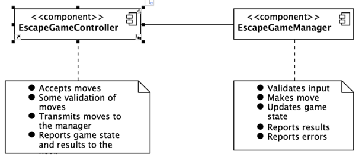
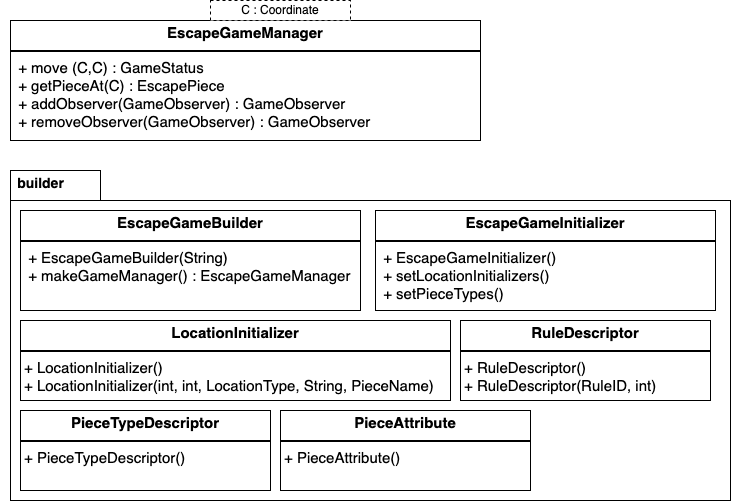
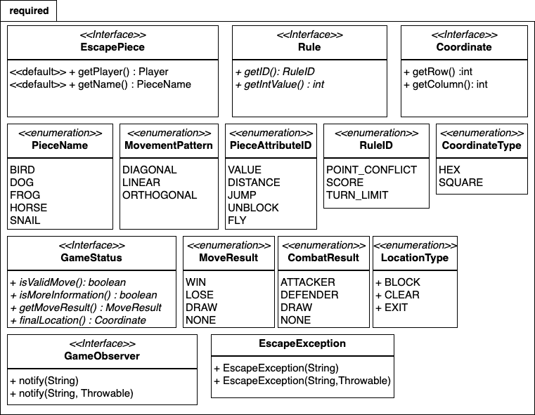
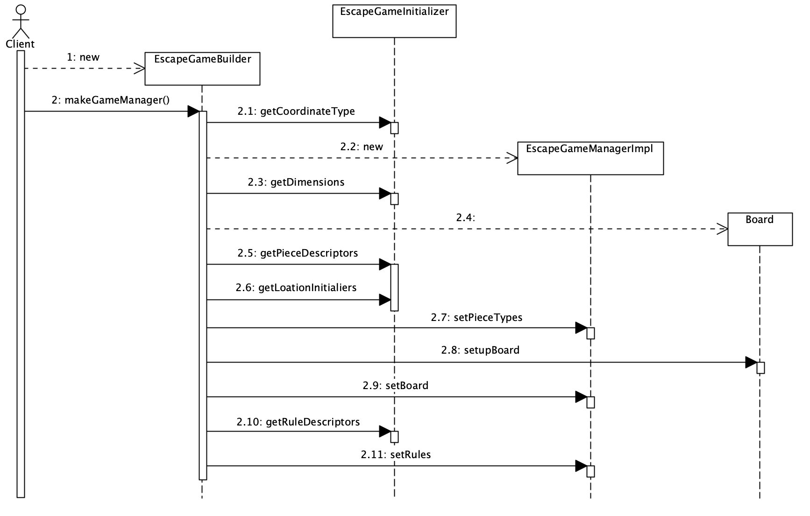

# Escape Starting Code

## Introduction

You are given a starter code for the Escape game. The stater code gives you a lot of freedom to design and organize your code as you want, but it means that you need to have a good understanding of the game and components. Please make sure to read and understand [Escape Game Requirements](Escape.md), before you read this manual. 

This manual provides a code walkthrough of the starting code. You should go through them quickly and then use them as reference as needed.

## Starting code overview

The starting code defines interfaces for required parts of the game and also contains the classes needed to load configuration files and create the `EscapeGameInitializer` instance so you can create your implementation of the complete game.

You will build an Escape game manager that takes its inputs from a client. The client could be a front end with a GUI or unit tests. That doesn't matter. You simply take the input, determine the move validity, change the game state, determine the outcome, and do this until the game is over. In the following diagram, it is called the `EscapeGameController`. The `EscapeGameManager` is shown as a component. It is, in fact a class that is the manager for the game logic. It uses many other classes that you will modify and create to do its job.



## Starter packages and classes

The following diagram shows the organization of the starter source code. You will also find libraries and one test in the zip file that you will download. You need these to be able to convert the configuration XML to objects (this is called marshalling). The starter code will be committed to your GitHub repo when you accept the assignment.





The diagram shows the view from the `escape` package which is the root of the project. There are three subpackages:

<!-- * `escape.exception` is a package to contain any Exception classes that you choose to use. There is one predefined, `EscapeException` which inherits `RuntimeException`. Any additional exception types you might create shoud reside in this package and extend `EscapeException`. -->

* `escape.required` contains mainly inerfaces and enumerations that are required. Some of these are obvious and others will be discussed in subsequent sections. None of these may be modified, but can be extended by other interfaces, and so on for your needs. Please don't include the classes that extend these under `required` package. They should be moved to appropriate packages as your design evolves. The `required` package in you submission should be unchaged (i.e., same as the starter code). 

* `escape.builder` contains several classes that are used by the `EscapeGameBuilder` and `EscapeGameInitializer`. We will examine them in detail when we look at how a game instance gets constructed from the configuration file.

* `EscapeGameManager` interface is included under the `escape` package and it should remain there. This is the main interface through which the client interfaces with the manager. `EscapeGameManager` has a generic type parameter. This guarantees that it can only work with a specific type of coordinate.

Before proceeding, make sure to pull or clone the starter code to your local repo and create the `milestone1` branch - see the instructions below. 
``` java 
// create a working directory for your project and initialize it as a git repository
mkdir escape-<yourGitHubusername>
cd escape-<yourGitHubusername>
git init
// connect your workdirectory with the remote GitHub repo and pull
git remote add origin <your repo URL>
git pull origin main
// create milestone1 branch
git branch milestone
git checkout milestone1
```
And make sure that you have code available when going through the following sections. Now let's start looking at the code in detail.

---

# Escape: `EscapeGameManager` Interface

This interface describes the total set of operations that a client (the controller) can use to interact with the game. You must create appropriate implementations of this interface when the client asks for a new one using the `EscapeGameBuilder` instance to create the game manager from a configuration file.

This is the interface. Look it over and make sure you understand it. We will go over some of the details below.

```java
/*******************************************************************************
 * This files was developed for CS4233: Object-Oriented Analysis & Design.
 * The course was taken at Worcester Polytechnic Institute.
 * All rights reserved.
 *******************************************************************************/
package escape;

import escape.required.*;

/**
 * This interface describes the behavior of the Escape game manager. Every instance
 * of an Escape game manager must implement this interface. The methods described here are
 * the only methods that a client can use when interacting with the game.
 * 
 * >>>YOU MAY NOT MODIFY THIS FILE IN ANY WAY, OR MOVE IT.<<<
 * You may extend this interface for your internal use in another interface, but this is the 
 * only public interface that all clients will use.
 */
public interface EscapeGameManager<C extends Coordinate>
{
	/**
	 * Make the move in the current game.
	 * @param from starting location
	 * @param to ending location
	 * @return true if the move was legal, false otherwise
	 */
	default GameStatus move(C from, C to)
	{
		throw new EscapeException("Not implemented");
	}
	
	/**
	 * Return the piece located at the specified coordinate. If executing
	 * this method in the game instance causes an exception, then this method
	 * returns null and sets the status message appropriately.
	 * @param coordinate the location to probe
	 * @return the piece at the specified location or null if there is none
	 */
	default EscapePiece getPieceAt(C coordinate)
	{
		throw new EscapeException("Not implemented");
	}
	
	/**
	 * Returns a coordinate of the appropriate type. If the coordinate cannot be
	 * created, then null is returned and the status message is set appropriately.
	 * @param x the x component
	 * @param y the y component
	 * @return the coordinate or null if the coordinate cannot be implemented
	 */
	C makeCoordinate(int x, int y);
	
	/**
	 * Add an observer to this manager. Whenever the move() method returns
	 * false, the observer will be notified with a message indication the
	 * problem.
	 * @param observer
	 * @return the observer
	 */
	default GameObserver addObserver(GameObserver observer)
	{
	    throw new EscapeException("Not implemented");
	}
	
	/**
	 * Remove an observer from this manager. The observer will no longer
	 * receive notifications from this game manager.
	 * @param observer
	 * @return the observer that was removed or null if it had not previously
	 *     been registered
	 */
	default GameObserver removeObserver(GameObserver observer)
	{
	    throw new EscapeException("Not implemented");
	}
}
```

## Notes on the code

* The generic variable is any class/interface that implements `Coordinate`, and this includes `Coordinate` itself. This provides some type safety for the game. You do not have to validate that you are given the appropriate type of coordinate.

* The main method of this interface is `move()`. The game is played by the players moving pieces. This is how the client tells the manager to move a piece. Note that all the manager needs is the pair of `from` and `to` coordinates. It can then go and ensure that there is a piece on the  from location, that there is a path to the to location, and so on. It simply returns true or false, depending upon the move attempt. More details are produced when you implement the observer in the final release.

* `getPieceAt()` should be self-explanatory. The client may want to acquire this information and will always do it by calling this method.

* `makeCoordinate()` is an important method. The client really does not know what your `Coordinate` implementation does. By using this method the proper type of coordinate is guaranteed. 

* `addObserver()` and `removeObserver()` are not used until the final release. Initially, the default implementation will throw the exception with the message `Not implemented`.

* Notice that in the header this tells you whether you may modify the file in any way, move it to another package, and if it is even required for your project.

Next we will look at how to build an instance of a game manager by using an `EscapeGameBuilder`.

---

# Escape: Building the Game

 The last section of the Escape manual (Escape: Configuring Games) talks about how to configure Escape game. We use configuration files to describe the boards, pieces, and other
game characteristics that the software will use to implement the game manager. 

 In this section we will look at the `EscapeGameInitializer` class  which builds an instance of the of an EscapeGameManager from a configuration file (.egc). 
 This uses the EscapeConfigurator for XML to turn the .egc file into a valid XML string that is then unmarshalled into an EscapeGameInitializer file. 
 We will also look at some of the other classes that are used as instance variables in `EscapeGameInitializer`. Then we will look at the `EscapeGameBuilder` class that creates the game manager to manage the game described in the configuration file.

## `EscapeGameInitializer`

If you understand the game description and structure of the configuration file, you can identify some of the objects that are necessary for playing the game:
* Coordinates
* Locations (tiles on the board)
* Board
* Pieces
* Rules

This does not necessarily mean that all of these will turn into classes or types in the implementation. But the configuration file contains everything we do need to create the objects for a specific game instance. The `EscapeGameInitializer` is a class that is a data structure with getters and setters for the data. It basically reflects the structure of the XML file. We wil not look at the getters and setters for this file, but will focus on the types and data that get extracted from the XML configuration. Notice the `@XMLRootElement` annotation. This is used by the JAVA XML binding library to indicate that `EscapeGameInitializer` is the root of the tree.

``` java
@XmlRootElement
public class EscapeGameInitializer
{
	private CoordinateType coordinateType;
	
	// Board items
	private int xMax, yMax;
	private LocationInitializer[] locationInitializers;
	
	// Piece items
	private PieceTypeDescriptor[] pieceTypes;
	
	// Rule items
	private RuleDescriptor[] rules;
    ...
```

1. The first field in the class is the coordinate type. It has the type `CoordinateType` which is enumeration defined in `Coordinate.java`. It defines the names for each of the coordinate types defined for the game. There are comments that should help you understand something about the behavior of the particular coordinate type.

2. The next fields define the maximum values for the x (row in square boards) and y (column in square boards) components of a coordinate. If either of these values is zero, it means that that dimension is infinite (I know, it means you could have a board that is 1 by infinity &mdash; you do not have to worry about this).

---

3. Locations have several components that define them: their coordinate, the type of the location (CLEAR, EXIT, BLOCK), if the is a piece on the location, it's type and which player owns it. All of these are encapsulated in a small data structure called a `LocationInitializer`. You can find the code for this in the `escape.builder` package.


```java
public class LocationInitializer
{
	public int x, y;
	public LocationType locationType;
	public String player;
	public PieceName pieceName;
	
	public LocationInitializer() 
	{
	    // needed for JAXB unmarshalling
	}
	
    public LocationInitializer(int x, int y, LocationType locationType,
        String player, PieceName pieceName)
    {
    	this.x = x;
        this.y = y;
        this.locationType = locationType;
        this.player = player;
        this.pieceName = pieceName;
    }

    /*
     * @see java.lang.Object#toString()
     */
    @Override
    public String toString()
    {
        return "LocationInitializer [x=" + x + ", y=" + y + ", locationType="
            + locationType + ", player=" + player + ", pieceName=" + pieceName + "]";
    }
}
```

---

You may notice that the fields are public. This is not normally good coding practice, but since this is an internal data structure that only is used during the game building, it makes the coding more concise and clear.

For most of the data structures in the start code, you will see a `toString()` method that will pretty-print the contents of the structure.
---

4. All of the location initializers are stored in an array in `EscapeGameInitializer`

<!-- **Note: In some games it may be possible to stack pieces on the board. This will not be allowed at the beginning of a game.** -->


5. Just as locations have several component attributes, so do pieces. Pieces have several characteristics that are defined by the game configuration. These are kept in a `PieceTypeDescriptor` object. The `PieceTypeDescriptor` class starts out like this:

```java
public class PieceTypeDescriptor
{
	private PieceName pieceName;
    private MovementPattern movementPattern;
    private PieceAttribute[] attributes;
    
    public PieceTypeDescriptor() {}
    // setters and getters follow
    ...
}
```

The `pieceName` and `movementPattern` are just enumerated values that label the piece type and how it moves. Since a piece may have several attributes (like `DISTANCE` with an integral value that says how far the piece may move). The `PieceAttribute` class  is used to encapsulate all of the information about an attribute, mainly a name and value, if any. These are kept in an array `PieceAttribute`objects inside of the `PieceTypeDescriptor`. Both the `PieceTypeDescriptor` and `PieceAttribute` classes are defined in the `escape.builder` package.

---

6. Even though rules may not be in the initial release, they will show up sometime. The rules in the configuration file are converted into an array of `RuleDescriptor` objects which are data structures that contain the `RuleID`, an enumerated value and the integer value associated with the rule, if any. The `RuleID` enumeration is inside of the `Rule` interface in the `escape.required` package and the `RuleDescriptor` class is defined in the `escape.builder` package.

```java
public class RuleDescriptor
{
	public RuleID ruleId;
	public int ruleValue;
	
	public RuleDescriptor()
	{
	    // needed for JAXB unmarshalling
	}
	
	/**
	 * Description
	 * @param ruleId
	 * @param ruleValue
	 */
	public RuleDescriptor(RuleID ruleId, int ruleValue)
	{
		this.ruleId = ruleId;
		this.ruleValue = ruleValue;
	}

	/*
	 * @see java.lang.Object#toString()
	 */
	@Override
	public String toString()
	{
		return "RuleDescriptor [ruleId=" + ruleId + ", ruleValue=" + ruleValue + "]";
	}
}
```

---

## `EscapeGameBuilder`

The `EscapeGameInitializer` object contains all of the information from the XML configuration. This occurs when you create an `EscapeGameBuilder` instance and give it the file name of the `.egc` file as an argument.

The beginning of `EscapeGameInitializer` does all of the work:

---

```java
public class EscapeGameBuilder
{
    private final EscapeGameInitializer gameInitializer;
    
    /**
     * The constructor takes a file that points to the Escape game
     * configuration file. It should get the necessary information 
     * to be ready to create the game manager specified by the configuration
     * file and other configuration files that it links to.
     * @param fileName the file for the Escape game configuration file (.egc).
     * @throws Exception on any errors
     */
    public EscapeGameBuilder(String fileName) throws Exception
    {
    	String xmlConfiguration = getXmlConfiguration(fileName);
    	// Uncomment the next instruction if you want to see the XML
    	// System.err.println(xmlConfiguration);
        gameInitializer = unmarshalXml(xmlConfiguration);
    }

	/**
	 * Take the .egc file contents and turn it into XML.
	 * If you want to use JSON, you should change the name of this method and 
	 * initizlize the EscapeConfigurator with this code:
	 * 		EscapeConfigurator configurator = new EscapeConfigurator(EscapeConfigurationJsonMaker());
	 * @param fileName
	 * @return the XML data needed to 
	 * @throws IOException
	 */
	private String getXmlConfiguration(String fileName) throws IOException
	{
		EscapeConfigurator configurator = new EscapeConfigurator();
    	return configurator.makeConfiguration(CharStreams.fromFileName(fileName));
	}

	/**
	 * Unmarshal the XML into an EscapeGameInitializer object.
	 * @param xmlConfiguration
	 * @throws JAXBException
	 */
	private EscapeGameInitializer unmarshalXml(String xmlConfiguration) throws JAXBException
	{
		JAXBContext contextObj = JAXBContext.newInstance(EscapeGameInitializer.class);
        Unmarshaller mub = contextObj.createUnmarshaller();
        return (EscapeGameInitializer)mub.unmarshal(
            	new StreamSource(new StringReader(xmlConfiguration)));
	}
...
```

---

Once the `EscapeGameInitializer` is created (which is already taken care of in the starter code), it is now time for you to build your `EscapeGameManager` object and return it to the client. This is done in the `makeGameManager()` method. This method is just a stub. It is where the starting code ends and you begin to evolve your design and implementation.

---
```...
    
    /**
     * Once the builder is constructed, this method creates the
     * EscapeGameManager instance. For this example, you would use the
     * gameInitializer object to get all of the information you need to create
     * your game.
     * @return the game instance
     */
    public EscapeGameManager makeGameManager()
    {
    	// >>> YOU MUST IMPLEMENT THIS METHOD<<<
    	return null;
    }
}
```

The flow of creating your game manager might look something like this:



---


